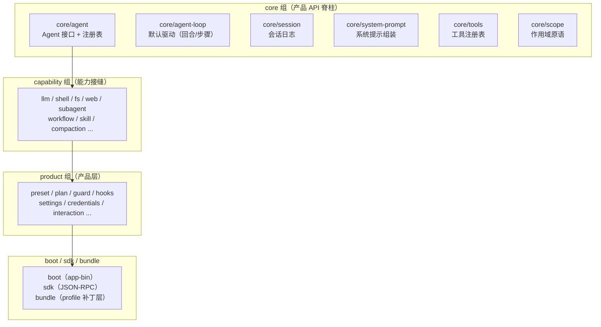

# 第 1 章 全景：一个"一切皆插件"的 Agent 框架

> **本章目标**
> 1. 建立 dsh 的整体心智模型："一切皆插件"到底意味着什么；
> 2. 看懂仓库布局：几十个包如何分层；
> 3. 理解 profile / bundle 的组合机制；
> 4. 读完 `docs/architecture.md`，掌握 dsh 官方认可的架构总纲。

## 1.1 一句话定位

> **dsh（DeepSeek Harness）是一个基于 vendored Cordis 的插件化 Agent 框架：
> everything is a plugin（一切皆插件）。**

这句话是 dsh 的 AGENTS.md 开篇第一句，也是理解整个仓库的钥匙。
它比普通的"插件架构"更强，体现在三处：

1. **没有特权核心**：连"模型适配器、工具注册表、会话日志、agent 循环本身"
   都是插件。看 `docs/architecture.md` 的原话：
   > There is no privileged core to patch: you extend dsh by mounting a plugin
   > beside the others, and registrations are effects that unwind when their
   > plugin unloads.

   意思是：你扩展 dsh，不是去改"核心"，而是在它旁边挂一个插件；所有注册都是
   **可撤销的副作用**（effects），插件卸载时自动回滚。

2. **每个能力都可替换**：从配置（profile/bundle）就能决定"用哪个模型适配器、
   哪个持久化后端、哪个沙箱实现"，不需要改代码。

3. **扩展靠文档化的扩展点**：加能力去注册工具/服务/事件，而不是改循环。

## 1.2 仓库布局：一张分层地图

dsh 是一个 pnpm workspace，`packages/` 下按"组"组织。读仓库时记住这张分层：



关键认识：**核心脊柱（core）只定义"接口与骨架"，具体能力由 capability 组的
插件提供，产品行为由 product 组的插件组装。** 这种分层让"加一个能力"
和"改一种行为"互不干扰。

## 1.3 运行时的树：profile 与 bundle

一个运行中的 `dsh` 不是"一坨程序"，而是一棵**在启动时按有序层组合出来的
插件树**。两个核心概念：

| 概念 | 通俗解释 | 存放位置 |
|------|---------|---------|
| **profile（配置文件）** | 一份"配方"：列出要叠加哪些 bundle、安装哪些外部插件、保留用户的补丁 | Harness home |
| **bundle（分发包）** | 一个可分发单元：一组 Cordis 配置行 + 它们挂载的代码 | 自己的 npm 包 |

每一层按顺序**覆盖**下一层：`profile 列出的每个 bundle → profile 的
cordis.patch.yml → home 级补丁 → --patch 覆盖层`。补丁按"行 id"替换整条配置
或插入新行。

三个内置 bundle 定义了 dsh 的三种形态：

| bundle | 作用 |
|--------|------|
| `dsh-base` | 每个 profile 的第一层：模型适配器、工具、持久化、沙箱与审批策略、设置、凭据、遥测 |
| `dsh-web-app` | 在 base 之上加浏览器应用 |
| `dsh-headless` | 一次性运行的 runner，没有任何服务器 |

> 验证你的机器实际启动的插件树：
> ```sh
> dsh --profile web --dump-config
> ```
> 打印出的每一行，你都可以用一条自己的补丁替换。

## 1.4 核心包速览（官方 table）

`docs/architecture.md` 用一张表总结了"谁拥有什么、挂在哪个 `ctx` 键上"，
这是 dsh 的"服务地图"起点：

| 包 | 拥有什么 | `ctx` 键 |
|----|---------|---------|
| `core/session` | 追加式 `SessionEvent` 日志 + 内存 store | `ctx.sessions` |
| `core/system-prompt` | 提示片段与工具 schema 的组装 | `ctx.systemPrompt` |
| `core/tools` | 作用域化的工具注册表 + 受保护执行流水线 | `ctx.tools` |
| `core/agent` | `Agent` 接口、活注册表、`agent/*` 事件 | `ctx.agents` |
| `core/agent-loop` | 实现 `Agent` 接口的默认驱动 | `ctx.agentLoop` |
| `core/scope` | 每 agent 作用域化注册原语 | 库，无键 |
| `llm/llm` | 消息与流词汇 + 适配器接缝 | `ctx.llm` |

**"ctx 键"是 dsh 里找服务的入口**：任何插件都能通过 `ctx.<键>` 找到并使用
某个服务，而不用 import 具体实现。第 2 章讲 Cordis 时会深入。

## 1.5 三个事件域：扩展点的第一决策

dsh 把事件分成三个"域"，**选对域是大多数改动要做的第一个决定**
（架构文档原文："picking the right domain is the first decision in most changes"）：

| 事件域 | 是什么 | 什么时候用 |
|--------|--------|-----------|
| **Session events** | 追加到日志的持久事实，经 `session/event` 广播 | 事实必须跨重启存活（消息、步骤、工具结果） |
| **Agent events（`agent/*`）** | 携带活 `Agent` 的事件：收件箱、步骤、状态、请求、校验、续跑 | 观察或拦截进行中的工作 |
| **Capability events** | 把策略/适配器挂到能力接缝上（`fs/*`、`tools/*`、`telemetry/*`） | 不 import 循环地给能力加行为 |

第 3 章会讲这些事件如何被"分发"（emit / waterfall / parallel / serial）。

## 1.6 一句话读完官方架构文档

`docs/architecture.md` 最后给了全书最重要的"新行为去哪"表，摘几行最常用的：

| 目标 | 机制 |
|------|------|
| 加一个模型 provider | 在 `ctx.llm` 注册适配器 |
| 加一个模型可见能力 | 在 `ctx.tools` 注册；其 schema 加入提示组装 |
| 拦截请求/工具/回合 | 用对应的 `agent/*` 或 `tools/*` 事件 |
| 加模型可见上下文 | `agent.inject()`，落入下一次被接受的请求 |
| 加持久会话状态 | 扩展 `SessionEventMap`，从日志渲染与回放 |
| 把注册限定到某个 agent | 用该 agent 的 `agent.ctx`（scope） |

**记住这张表**：它就是你以后在 dsh 里"新功能放哪"的索引。

## 1.7 本章小结

- dsh = 基于 Cordis 的插件化 Agent 框架，"一切皆插件、无特权核心、注册即副作用"；
- 仓库分层：core 脊柱 → capability 能力 → product 产品 → boot/sdk/bundle；
- profile + bundle 决定运行时的插件树，补丁按行覆盖；
- 事件分三域：session / agent / capability，选对域是第一决策；
- "新行为去哪"表是扩展 dsh 的索引。

## 动手练习

1. 打开 `docs/architecture.md`，把"Where new behavior goes"那张表抄一遍，
   标出你已经理解/还不理解的机制。
2. 跑 `dsh --profile headless --dump-config`（或 web），看看你的机器启动的
   插件树长什么样，找出一条可以被补丁替换的行。
3. 思考题：为什么 dsh 强调"registrations are effects（注册即副作用）"？
   （提示：从插件卸载、热重载、测试隔离三个角度想，答案见附录 C。）

---

**下一章**：[第 2 章 Cordis：插件框架的五件事](./ch02-cordis.md)
