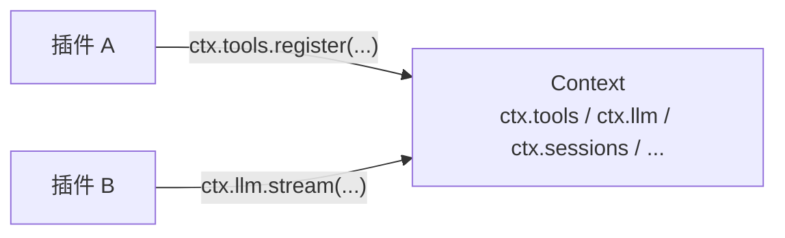

# 第 2 章 Cordis：插件框架的五件事

> **本章目标**
> 1. 掌握 Cordis 的五个核心概念：插件、上下文、注入、类型化事件、可逆效果；
> 2. 理解 `ctx.<key>` 服务定位如何取代"import 具体实现"；
> 3. 理解 `inject` 声明依赖如何取代"手动启动顺序"；
> 4. 为第 3 章的事件分发模式打基础。

## 2.1 为什么要先学 Cordis

dsh 构建在 **vendored Cordis**（一个被 vendored/钉住的插件框架）之上。
`docs/architecture.md` 明确要求：**改 `packages/` 之前先读 Cordis primer。**

Cordis 不是"某个无关的库"，而是 dsh 的**操作系统**——它定义了插件如何
挂载、服务如何被发现、事件如何派发、副作用如何回滚。不理解 Cordis，
dsh 的每一个 `ctx.xxx` 都是魔法；理解了它，dsh 就变成"用 Cordis 方言
写业务"。

`docs/cordis-primer.md` 用一句话总结了 Cordis 的五个想法，我们逐一展开。

## 2.2 五个核心想法

### 想法一：插件是一个实现 Service 的对象

> A plugin is an object that implements Service. It can be a function with
> optional `inject` and `apply(ctx)` fields, or a `Service` subclass whose
> lifecycle Cordis mounts into the current context.

插件有两种形态：

```ts
// 形态 A：函数插件（最常见）
const myPlugin: Plugin = (ctx) => {
  // 在 ctx 上注册服务/事件/工具……
  // 返回一个"卸载器"
  return () => { /* 清理 */ }
}

// 形态 B：Service 子类（生命周期由 Cordis 挂载）
class MyService extends Service {
  constructor(ctx: Context) {
    super(ctx, 'myService')
  }
  // ...
}
```

**关键认识**：插件的"应用"（apply）不是跑一遍就完，而是**在 ctx 上建立
一堆可撤销的注册**。这就是"注册即副作用"的来源。

### 想法二：上下文（Context）是服务的仓库

> A context is a repository of services. A service claims a stable `ctx.<key>`
> such as `ctx.tools`, `ctx.llm`, or `ctx.sessions` from a context; other
> plugins find services via key instead of importing a concrete implementation.



**这是 dsh 解耦的第一层**：插件 A 用 `ctx.llm.stream()` 调模型，
它根本不知道"当前用的是 DeepSeek 适配器还是 pi-ai 适配器"——
只认 `ctx.llm` 这个键。服务由键定位，而不是由 import 定位。
所以"换模型适配器"只是配置层的选择，消费方代码零改动。

### 想法三：用 `inject` 声明服务依赖

> A plugin that names required services waits until those services exist, so
> load order is expressed through service requirements rather than manual
> boot sequencing.

插件可以声明"我需要哪些服务"，Cordis 会**等这些服务存在后才执行我的 apply**：

```ts
const plugin: Plugin = {
  inject: ['llm', 'tools'],   // 声明依赖：ctx.llm 与 ctx.tools 就绪后
  apply(ctx) {
    // 这里可以放心使用 ctx.llm / ctx.tools
  },
}
```

**为什么这很重要**：传统框架用"启动顺序"（先加载 A 再加载 B）来保证依赖，
脆弱且难以重排。Cordis 用"服务依赖"表达顺序——你只需要说"我需要什么"，
框架保证"需要时它已存在"。这大大提高了插件的可组合性。

### 想法四：类型化事件（Typed Events）用于通信

> Services declare event names through TypeScript declaration merging, then
> dispatch them as `emit`, `waterfall`, `parallel`, or `serial`.

服务通过 **TypeScript 声明合并（declaration merging）** 声明事件名，
然后按四种模式派发。看 dsh 里怎么声明一个事件（`packages/core/session/src/index.ts`）：

```ts
declare module '@deepseek-ai/cordis' {
  interface Context {
    sessions: SessionStore
  }
  interface Events {
    /**
     * Creation announcement during session publication. ...
     * @mode emit
     */
    'session/created'(session: Session): void
  }
}
```

**声明合并**让"事件名"既是类型安全的 API，又是可 grep 的字符串。
任何插件只要 `ctx.on('session/created', ...)` 就能监听，而类型系统会保证
回调参数正确。

### 想法五：注册是可逆效果（Reversible Effects）

> Prompt sections, tool schemas, adapters, providers, and listeners are
> installed through `ctx.effect()` or `ctx.on()` so reload and teardown
> unwind them predictably.

dsh 的 AGENTS.md 有一条硬规则：
> **Registrations are effects**: every contribution goes through
> `ctx.effect()` / `ctx.on()`; a registry's `register()` returns the disposer.

翻译：**每个注册都走 `ctx.effect()`/`ctx.on()`，注册表的 `register()` 返回
"卸载器"（disposer）**。这意味着：

- 插件卸载时，它注册的工具、事件、系统提示片段**全部自动撤销**；
- 热重载、测试隔离、试错性挂载都安全——挂上能卸，不会残留状态。

## 2.3 四个分发模式（Dispatch Modes）

Cordis 的事件有四种分发模式，由派发方法决定。这是第 3 章的地基，先列出来：

| 模式 | 是否等待 | 顺序 | 有无返回值 |
|------|---------|------|-----------|
| `emit` | 否 | 按注册顺序观察 | 无 |
| `waterfall` | 否 | 按注册顺序观察 | 有 |
| `parallel` | 是 | 并行观察 | 无 |
| `serial` | 是 | 按注册顺序观察 | 有 |

**模式是事件公开契约的一部分**：dsh 的每个事件都用 `@mode` 标注，
生成的目录会校验"声明模式"与"派发方式"是否一致。

## 2.4 瀑布语义：`next()` 与短路

`waterfall` 是 dsh 里最重要的扩展机制（第 7 章你会反复见到）。Cordis 的
瀑布语义（`docs/cordis-primer.md` 原文）：

> `ctx.waterfall` is around-middleware. A listener receives `(...args, next)`.
> Call `next()` to delegate the possibly wrapped result to the next service;
> return without `next()` to short-circuit.

```mermaid
flowchart LR
    REQ[请求/决策对象] --> L1[监听器 1]
    L1 -->|调用 next()| L2[监听器 2]
    L2 -->|调用 next()| L3[终点处理器]
    L1 -.->|不调用 next() 直接返回| OUT1[短路，结果自定]
    L3 --> OUT[结果]
```

**两条铁律**：
1. **要委托，必须调用 `next()`**；不调用就是短路，下游不会执行；
2. **协作式监听器通常改写共享对象后 `next()`**；策略式监听器可以
   不调 `next()` 直接"拍板"。

dsh 的 AGENTS.md 也强调：
> Waterfall listeners MUST call `next()` to delegate; returning without it
> short-circuits the chain.

## 2.5 配置加载：`!!js` 与 overlay

一个容易踩坑的 Cordis 细节（`docs/cordis-primer.md` 的 Loader Configuration）：

- `!!js`（注意是**双感叹号**，绝不是 `!js`）会在插件 `config` 和入口
  `disabled` 字段里被解析成表达式；
- 其他元数据保持字面量；
- **当环境要选择插件时，用 overlay（覆盖层），而不是写死条件**。

dsh 的 AGENTS.md 对此有对应规则（"cordis.yml allows `!!js` (never `!js`)"），
第 17 章讲配置时再展开。

## 2.6 本章小结

- Cordis 五件事：插件对象、Context 服务仓库、inject 依赖、类型化事件、可逆效果；
- `ctx.<key>` 服务定位取代 import，是 dsh 解耦的第一层；
- `register()` 返回 disposer，"挂上能卸"；
- 事件四模式：emit / waterfall / parallel / serial；
- 瀑布语义：`next()` 委托、不调用即短路。

## 动手练习

1. 在 dsh 仓库里 `grep -rn "ctx.effect" packages/ | head`，找一个真实插件的
   注册代码，确认它返回了 disposer。
2. 找一个 `declare module '@deepseek-ai/cordis' { interface Events {...} }` 的
   声明，读出它的 `@mode` 与 `@param`。
3. 思考题：为什么"服务用键定位"能带来"换 provider 不改消费方"？
   （提示：结合第 1 章 dsh 的能力替换说。）

---

**下一章**：[第 3 章 事件系统：扩展点与四种分发模式](./ch03-events.md)
