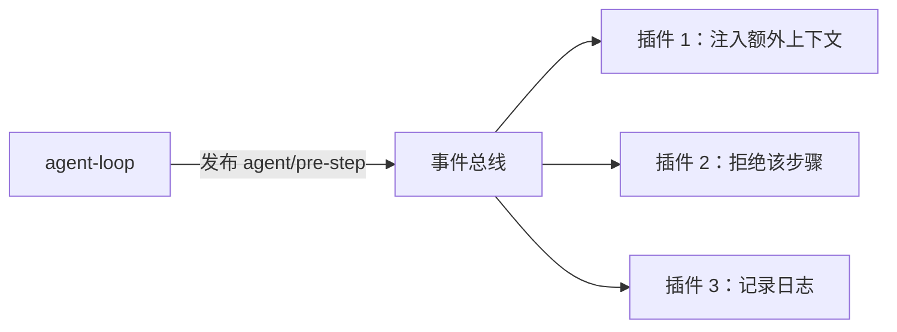

# 第 3 章 事件系统：扩展点与四种分发模式

> **本章目标**
> 1. 理解事件在 dsh 里扮演的角色：**扩展点就是事件**；
> 2. 掌握 emit / waterfall / parallel / serial 四种模式的取舍；
> 3. 看懂事件声明（`@mode`）与派发的一致性原则；
> 4. 认识三个事件域（session / agent / capability）与"选对域"的决策。

## 3.1 生活化开场：不是"回调地狱"，而是"公告栏"

在传统代码里，你要扩展一个功能，常常要"改它的代码"（在它内部加回调）。
dsh 反其道而行：**核心循环不关心谁在听，它只负责"发布公告"（dispatch event）。**
任何人想介入，就去"公告栏"（事件）上登记自己。



**"选对事件域 + 选对分发模式"是 dsh 扩展的第一课。** 本章把这两件事讲透。

## 3.2 事件是"扩展点"，分三个域

第 1 章提过三个事件域，这里展开。它们的区别本质是**"事件是否要持久化"和
"事件带什么载荷"**：

| 域 | 例子 | 持久化？ | 载荷 | 用途 |
|----|------|---------|------|------|
| **Session** | `turn/start`、`user/message`、`assistant/message`、`tool/result` | 是（进日志） | 可重建的纯数据 | 模型看到的一切、审计、回放 |
| **Agent（`agent/*`）** | `agent/pre-step`、`agent/request`、`agent/status`、`agent/turn-stopping` | 否（运行期） | 活的 `Agent` 对象 | 观察/拦截进行中的工作 |
| **Capability** | `tools/*`、`fs/*`、`telemetry/*` | 否 | 策略/适配器相关 | 给能力接缝挂行为，不 import 循环 |

**一个直觉**：需要"跨重启活下来"的事实 → Session 域；只是"现在这一刻
我想插手"→ Agent / Capability 域。把"想持久化的事实"误放成运行期事件，
是新手常犯的错——它会破坏"模型可见 ⟺ 可记录"（第 5 章）。

## 3.3 四种分发模式：怎么选

Cordis 支持四种模式，决定"监听者怎么被调用、要不要等、有没有返回值"。
我们用一个"读者反馈"类比：

| 模式 | 类比 | 语义 | 典型 dsh 用例 |
|------|------|------|--------------|
| `emit` | 广播通知 | 依次通知，不等结果，无返回值 | `session/event`、`agent/status` |
| `waterfall` | 依次传递改写的物品 | 每个监听者可以改写后传给下一个；`next()` 委托，不调用即短路 | `agent/pre-step`、`agent/request`、`llm/stream`、`tools/pre-execute` |
| `parallel` | 同时分头调查 | 并发跑所有监听者，都完成后继续 | `session/flush`（并行刷盘） |
| `serial` | 排队盖章 | 按顺序跑，返回值向后传递 | `agent/turn-stopping`（回合停止前依次给机会） |

### emit：观察，不干预

```ts
this.dispatch.emit('agent/status', { status })   // 通知订阅者"状态变了"
```

`emit` 的监听者是**观察者**：他们看到事件、做自己的事（记录、刷新 UI），
但不能改变事件结果。适合"对外广播"。

### waterfall：围绕中间件，可改写可短路

`waterfall` 是 dsh 的"决策点"。看第 7 章会精读的 `agent/pre-step`——它决定
"模型这次看到什么"：

```ts
const decision = await this.dispatch.waterfall(
  'agent/pre-step', { messages: claimed, ...position, signal },
  (): Promise<PreStepDecision> => Promise.resolve({
    kind: 'enter',
    messages: context === undefined ? claimed : [...claimed, context],
  }),
)
```

任何插件都可以监听 `agent/pre-step`，改写 `messages`（比如注入上下文），
或直接返回 `{ kind: 'reject' }` 拒绝该步骤。**这就是 dsh 让"外部策略"
介入循环的方式。**

### parallel：并发收尾

`parallel` 让所有监听者并发执行，全部完成后才继续。典型用例是
`session/flush`——多个持久化后端（JSONL、SQLite）并行刷盘，一起确认写完了，
调用方再继续。

### serial：有序给机会

`serial` 按注册顺序执行，返回值向后传。典型用例 `agent/turn-stopping`：
回合要结束时，依次给每个插件"最后说句话"的机会（比如"我还要追加一条
总结消息"）。

## 3.4 一致性：`@mode` 是契约

dsh 要求每个事件声明自己的模式（`@mode`），并且**派发方式必须与声明一致**
（生成的目录会校验）。看 `docs/subsystems/core.md` 里 `agent/pre-step` 的
声明（节选）：

```ts
'agent/pre-step'(
  this: Scoped<Agent>, ...,
  next: () => Promise<PreStepDecision>,
): Promise<PreStepDecision>
```

（声明为 waterfall，派发也用 `dispatch.waterfall`。）

**为什么一致性重要**：如果某个插件以为 `agent/turn-stopping` 是 waterfall
（以为调用 `next()` 就能继续），而实际它是 serial（没有 `next()`），
它的逻辑会出错。把模式写进契约，让"怎么用"可机械校验。

## 3.5 观察 vs 拦截：先想清楚你的插件要哪种

dsh 的扩展分两种基本姿态（`docs/cordis-primer.md` 的 Practical Rules）：

> Prefer events for interception and policy; prefer service methods for
> direct capability calls.

- **观察（observe）**：只读，用 `emit` 事件，不改结果（如遥测、日志）；
- **拦截（intercept）**：改写/决策，用 `waterfall` / `serial` 事件
  （如审批、注入上下文）；
- **直接调用能力**：用服务方法（如 `ctx.llm.stream()`），不要绕事件。

**判断口诀**：如果你想"看到它"，用 emit；想"改变它"，用 waterfall/serial；
想"直接干"，用服务方法。

## 3.6 事件目录：哪里查所有事件

dsh 生成了一份**事件地图** `docs/event-producer-consumer.md`，列出每个事件的
生产者与消费者。这是你回答"这个事件谁发、谁在听"的权威来源。
（第 7 章你会看到 `agent/*` 事件的完整清单。）

## 3.7 本章小结

- 扩展点 = 事件；三个域：session（持久）、agent（运行期拦截）、capability（能力策略）；
- 四模式：emit（广播）/ waterfall（可改写可短路）/ parallel（并发收尾）/ serial（有序盖章）；
- `@mode` 是事件契约，声明与派发必须一致；
- 观察用 emit，拦截用 waterfall/serial，直接干用服务方法。

## 动手练习

1. 打开 `docs/event-producer-consumer.md`，找 `agent/pre-step` 与
   `session/event`，各读出"生产者"与"消费者"。
2. 在 `packages/core/agent/` 里 `grep -rn "@mode waterfall"` 或
   `@mode serial`，列出这些事件的名字，猜猜为什么选那种模式。
3. 思考题：为什么 `agent/turn-stopping` 是 serial 而不是 waterfall？
   （提示：它有没有"改写返回值"的需求？答案见附录 C。）

---

**下一章**：[第 4 章 会话与事件溯源：日志即真相](./ch04-session.md)
第一部分到此结束。接下来进入全书的核心——会话与事件溯源。
