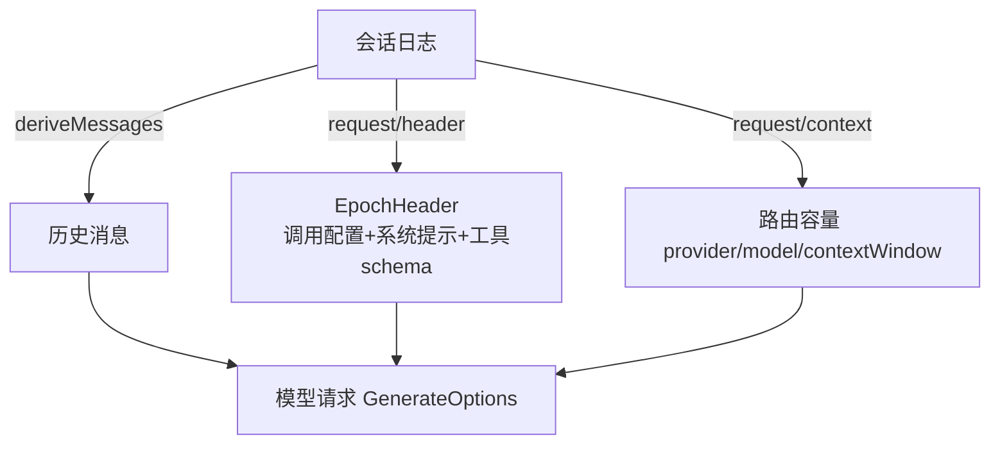

# 第 5 章 模型可见 ⟺ 可记录：请求可重建

> **本章目标**
> 1. 吃透 dsh 最核心的不变量："模型可见 ⟺ 可记录"；
> 2. 理解请求如何从会话日志重建（`EpochHeader`、冻结、纯函数投影）；
> 3. 理解三个推论：前缀缓存稳定、字节级审计、可归因的分叉；
> 4. 学会用这个不变量做调试与测试。

## 5.1 一个真实痛点

想象你在排查一个问题："模型上次为什么这么回答？"你打开日志，结果发现——
日志里只有对话文本，**没有记录当时用的系统提示、工具清单、模型参数**。
你根本没法还原"模型当时到底看到了什么"。

这几乎是所有 Agent 框架的通病：**请求是"现场拼"的，拼完就没了**。
dsh 用一条铁律从根上消灭这个问题。

## 5.2 铁律：Model-visible ⟺ logged

dsh 的 AGENTS.md 原文：

> **Model-visible ⟺ logged**: anything that reaches a model request must be
> reconstructable from the session log; a new model-visible input requires a
> session event.

翻译：**任何到达模型请求的东西，都必须能从会话日志重建；任何新的模型可见
输入，都必须是一个会话事件。**

更精确的表述（Agent Note `2026-07-05-reconstructable-requests`）：

> **Model-visible ⟺ durably referenced.** Anything that reaches a model
> request must be reconstructable from the session log and the immutable
> content-addressed objects it references.

注意措辞升级为 "**durably referenced**"：纯文本请求是日志的纯函数；
含图片的请求还引用**内容寻址的附件对象**（通过 `ctx.attachments` 解析字节，
校验摘要与元数据，缺失/损坏时 fail loud）。

**可检查的推论**（Note 原文）：
> anyone holding the log, its referenced attachment objects, and the pinned
> code version reconstructs every loop request byte-for-byte.

只要你有：日志 + 被引用的附件 + 钉住的代码版本 → 就能**逐字节**重建
每一次循环请求。

## 5.3 请求如何被"重建"

回顾第 7 章（agent-book）见过的 `buildRequest`（`packages/core/agent-loop/src/agent.ts`），
现在从"可重建"的角度重新理解它：

### ① 请求的历史部分 = 日志的投影

```ts
const { request, preparedCall } = await this.buildRequest(
  turn, step, assembly.tools, system, this.session.deriveMessages(), signal,
)
```

`deriveMessages()` 从日志派生消息——**历史部分天然是日志的函数**。
dsh 从不维护一份"独立的当前消息数组"，所以不存在"日志之外的历史"。

### ② 请求的非历史部分 = `EpochHeader`

模型看到的除了消息，还有：**调用配置（provider/model/温度…）、渲染后的系统
提示、工具 schema**。这些被记进 `request/header` 事件（`EpochHeader`），
`request/context` 记路由容量。看 `docs/subsystems/session.md`：
`request/header` 记录 request 的 non-history state。



### ③ 请求被"深冻结"

构造完的请求是**深冻结（deep-freeze）**的，并且被标记为 loop 请求
（`markAgentLoopRequest`）。含义：**请求一旦构造，任何人在发出前都不能改它。**
如果插件想改，只能在 `agent/request` 瀑布里改"配置提案"，改完再冻结。
这保证了"日志里记的"和"实际发出的"永远一致。

## 5.4 三个推论：为什么这条铁律这么值钱

Agent Note 把不变量带来的收益总结成三个推论：

### 推论一：前缀缓存稳定（prefix-cache stability）——是涌现的，不是管理的

追加式日志 + 逐节点纯函数投影 → **只要 header 不变，后一个请求就是
前一个请求的追加扩展**。这对 provider 的前缀缓存非常友好：相同的前缀
可以命中缓存，省 token 省钱。**dsh 没有去"管理"缓存稳定性，它是事件溯源
自然涌现的结果**——这是"结构保证"优于"手动保证"的典型例子。

### 推论二：字节级审计 / 回放（byte-exact audit/replay）

有日志 + 附件 + 代码版本，就能逐字节复现"模型当时看到了什么"。
**调试"模型为什么这么答"从"猜"变成了"回放"。**

### 推论三：带归因的分叉（resume / fork with attributable drift）

恢复（resume）或分叉（fork）一个会话时，任何与原始会话的偏差都是
**可归因**的（能指出"哪一步、因为什么"变了），而不是黑盒漂移。

## 5.5 这条不变量如何被"强制"

光写进文档不够，dsh 用几层可机械检查的机制把它钉死（第 16 章展开）：

- `docs/architecture.md` 的 **"Model-visible means logged"** 本身就是硬约束：
  > Every model request must be reconstructable from the log. New
  > model-visible inputs require session events.
- **`SessionEventMap` 类型 + required-on-read**：不认识某个事件类型的构建会
  拒绝加载该日志（除非事件带 `ignorable: true`）——把"漏记"变成"读不回来"；
- **插件自有的消息投影**：要改消息内容必须注册一个纯投影
  （`docs/subsystems/session.md` 的 "Plugin-owned message projections"），
  可被独立调用核对；
- **执行的顶层门禁**（`scripts/` 下的 `verify-*`，跑在 `doc-sync` / CI 里）
  与**无 key 快照测试**（第 16 章）从两侧夹住。

（早先 dsh 有一个包自有的运行时不变量注册表 `ctx.invariants`，把各包的契约
检查接进顶层门禁；它在 v0.2.0-rc.2 被整体移除，见
`docs/upgrade-guide/v0.2.0-rc.2/remove-runtime-invariants/guide.md`。）

**实践含义**：如果你给 dsh 加一个"模型可见的新输入"（比如新的上下文注入），
你**必须**同时加一个会话事件来记录它。想偷懒"只注入不记录"，会在日志加载
或快照门禁处暴露——这正是 dsh 把工程纪律变成"可执行检查"的体现。

## 5.6 一个直接的收获：快照测试（snapshot test）

"请求可重建"让 dsh 的**快照测试**成为可能：把一次真实对话的日志保存下来，
没有 API key 时也能重放，对比模型输出与预期。AGENTS.md 的测试策略要求：

> Every non-trivial model- or product-user-visible behavior change adds or
> updates a keyless snapshot through a real runnable example in the same PR.

**没有"可重建日志"这条地基，快照测试根本无从谈起。** 这条不变量既是
架构承诺，也是测试基建的前提。

## 5.7 本章小结

- 铁律：**模型可见 ⟺ 可记录**（更精确：durably referenced）；
- 请求 = 日志投影的历史 + `EpochHeader` 记录的非历史状态 + 深冻结；
- 推论：前缀缓存稳定（涌现）、字节级审计回放、带归因的分叉；
- 加模型可见输入必须加会话事件，由类型（required-on-read）与门禁强制；
- 快照测试依赖这条地基。

## 动手练习

1. 在 `packages/core/agent-loop/src/agent.ts` 里找 `buildRequest`，逐行确认
   "历史来自 deriveMessages、非历史写 request/header、结果 deepFreeze"。
2. 读 Agent Note `2026-07-05-reconstructable-requests.md` 全文，找出
   "EpochHeader 记录哪些字段"。
3. 思考题：为什么图片请求要"内容寻址 + 校验摘要"，而不是直接记文件路径？
   （提示：可变路径会让"逐字节重建"失效。）

---

**下一章**：[第 6 章 Agent 抽象与生命周期](./ch06-agent.md)
