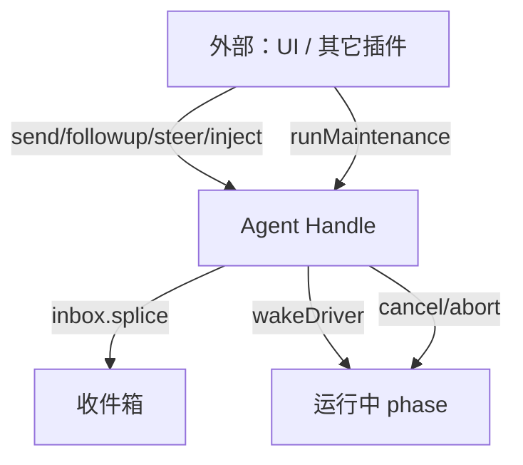

# 第 6 章 Agent 抽象与生命周期

> **本章目标**
> 1. 理解 `Agent` 接口：一个"会话的驱动器"应该长什么样；
> 2. 掌握 agent 的创建、所有权与销毁（lifecycle / ownership contracts）；
> 3. 理解 Initiating Agent（发起者）与 scope 的关系；
> 4. 通读 `agent/*` 事件清单，建立"运行期拦截"的完整视图。

## 6.1 从接口到实现：`Agent` 与 `ReactLoopAgent`

dsh 把"Agent"拆成**接口**与**默认实现**两层：

- **`Agent` 接口**（`packages/core/agent/src/types.ts`）：定义"一个会话驱动器"
  的契约——收消息、开回合、被取消、注入上下文；
- **`ReactLoopAgent`**（`packages/core/agent-loop/src/agent.ts`）：默认实现，
  就是我们第 7 章要精读的"回合/步骤"驱动。

**为什么拆两层**：`core/agent` 定义"Agent 是什么"（契约），`core/agent-loop`
定义"默认怎么驱动"（实现）。按 dsh 的哲学，**agent-loop 本身也是可替换的插件**
——你完全可以挂一个自己的驱动实现 `Agent` 接口。`ctx.agentLoop` 只是
"默认驱动"的注册。

## 6.2 创建、所有权与销毁

`docs/subsystems/core.md` 的 "Creation and ownership" 一节讲清了谁拥有什么。
它取代了早期 Agent Note `2026-06-18-agent-lifecycle-and-ownership-contracts`
（已于 2026-09-04 归档，只作历史）。关键契约：

- **一个会话对应一个 Agent**：`ctx.agents`（`AgentRegistry`）负责创建与登记；
- **所有权明确**：谁创建，谁负责销毁；`agent/disposed` 事件广播销毁；
- **作用域（scope）随 agent 创建**：每个 agent 有一个 `agent.ctx`，
  用它可以把注册（事件监听、工具、系统提示片段）**限定到这一个 agent**
  （第 13 章深入）。

销毁不是可选的：`agent/disposed` 要触发时，**agent 作用域内注册的一切**
（监听器、效果）都要回滚——这正是第 2 章"注册即副作用"的生命周期体现。

## 6.3 The Agent Handle：对外的操作面

`docs/subsystems/core.md` 的 "The agent handle" 一节描述了 `Agent` 对外暴露的
操作面。一个 Agent 本质上是一个"**活的对象**"，外界通过它：

- **send / followup / steer / inject**：向收件箱投递消息（第 7 章详述
  next-turn / next-step 目标）；
- **cancel / abort**：取消进行中的活动；
- **whenIdle**：等待空闲；
- **runMaintenance**：在维护阶段跑压缩等任务。



**Agent 是一个"句柄（handle）"而非"过程"**：外部代码不"调用"它跑完，而是
向它投递消息、观察它、在需要时打断它。这种设计让"多源输入"（用户打字、
后台任务、子代理回报）都能自然汇入同一个会话。

## 6.4 Initiating Agent：谁在发起这次工作

dsh 有一个重要的运行期概念：**Initiating Agent（发起者）**。
`docs/subsystems/core.md` 的 "Initiating Agent" 一节，以及
`packages/core/agent/src/` 里的 `withInitiator`：

- 每当一个 agent 开始一个回合/步骤，它成为那个上下文的"发起者"；
- 工具执行、事件派发时，代码可以 `ctx.agents.requireInitiator()`
  拿到"是谁发起的"，从而把行为**归属**到正确的 agent；
- 这解决了"工具执行时，我在为哪个会话工作？"的归属问题（多 agent / 子代理
  场景尤其重要，见第 12 章 subagent）。

看 `agent-loop/src/tool-calls.ts` 里一行（第 7 章会再见到）：
```ts
const agent = ctx.agents.requireInitiator()
```
工具调度器就是靠它拿到"发起这个工具调用的 Agent"，从而访问其 `session`。

## 6.5 `agent/*` 事件清单：运行期扩展点全景

`docs/subsystems/core.md` 用几百行逐一文档化了 `agent/*` 事件。摘最重要的：

| 事件 | 模式 | 含义 |
|------|------|------|
| `agent/created` / `agent/disposed` | emit | 生命周期广播 |
| `agent/status` | emit | 状态变化（idle/running） |
| `agent/error` | emit | 失败在活边界上报 |
| `agent/assistant-stream` | emit | 运行期流式帧（attemptId + revision，不进日志） |
| `agent/inbox/inserted` / `discarded` / `claimed` | emit | 收件箱投递轨迹（运行期通知） |
| `agent/pre-step` | **waterfall** | 决定"模型这次看到什么"（改写/拒绝） |
| `agent/request` | **waterfall** | 决定请求配置（provider/model/参数） |
| `agent/request-error` | **waterfall** | 请求失败后的处置（可让插件决定重试） |
| `agent/turn-stopping` | **serial** | 回合即将停止时依次给插件最后机会 |

**注意模式分布**：凡是"要改决策"的（pre-step、request、request-error）都是
waterfall；凡是"只通知"的（created、status、error）都是 emit；唯一一个
"按序给机会"的是 serial 的 turn-stopping。这与第 3 章的模式选择规则完全一致。

> 上表全是**运行期**事件。收件箱还有一个**持久**事件 `agent/inbox/spliced`
> ——它由 `Session.append()` 落进日志，是待处理消息列表的规范化变更记录
> （`inserted/discarded/claimed` 只是它之上的运行期通知）。

## 6.6 本章小结

- `Agent` 接口与 `ReactLoopAgent` 实现分离，驱动可替换；
- 创建/所有权/销毁有明确契约，`agent.disposed` 时作用域注册全部回滚；
- Agent 是"句柄"：投递消息、观察、打断，而非"过程调用"；
- Initiating Agent 解决"我在为谁工作"的归属；
- `agent/*` 事件构成运行期扩展点全景：改决策用 waterfall，通知用 emit。

## 动手练习

1. 打开 `docs/subsystems/core.md` 的 "agent/* events" 一节，挑三个事件
   读出它们的 `@mode`、`@param` 与"何时触发"。
2. 在 `packages/core/agent/src/types.ts` 里读 `Agent` 接口定义，列出
   它对外暴露的所有方法。
3. 思考题：为什么 `agent/request` 用 waterfall 而不是 emit？
   （提示：插件想"改 provider"该怎么办。）

---

**下一章**：[第 7 章 agent-loop 精读：回合、步骤、收件箱](./ch07-agent-loop.md)
