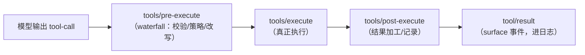

# 第 9 章 工具系统：注册表与执行流水线

> **本章目标**
> 1. 理解 `ctx.tools`：作用域化的工具注册表 + 受保护执行流水线；
> 2. 掌握工具 schema（`ToolSchema`）与 JSON Schema 校验；
> 3. 深入工具调度器：并行/排他、结果保序、超时、溢出；
> 4. 理解工具执行流水线（pre-execute / execute / post-execute）。

## 9.1 `ctx.tools`：工具的"家"

`docs/subsystems/tools.md` 对 `ctx.tools` 的定位：

> The scoped tool registry and guarded execution pipeline.

- **作用域化（scoped）**：工具可以注册到全局，也可以注册到某个 agent 的
  scope（第 13 章）——不同会话可以有不同的工具集；
- **受保护（guarded）**：执行前经过策略检查（审批、沙箱），不裸跑；
- **流水线（pipeline）**：执行分 pre / execute / post 三个阶段（见 9.4 节）。

工具的模型可见部分是一个 `ToolSchema`（`packages/llm/llm/src/types.ts`）：

```ts
export interface ToolSchema {
  name: string
  description: string
  parameters: Record<string, unknown>   // JSON Schema
  deferLoading?: true                   // 请求把定义延后加载进模型上下文
}
```

schema 会**加入系统提示组装**（第 13 章），让模型知道有哪些工具可用。

## 9.2 执行模式：并行 / 排他

dsh 的工具执行模式（`ToolExecutionMode`）不是简单"串行/并行"二分，而是：
**parallel（并行）+ exclusive（排他）**。`packages/core/tools/src/index.ts`
里有 `ctx.tools.executionMode(request)` 返回当前调用的模式。

| 模式 | 语义 | 调度行为 |
|------|------|---------|
| `parallel` | 可与其他调用并发 | 进入并行池，有界并发 |
| `exclusive` | 必须独占（如改同一文件） | 形成"屏障"：等当前池排空后单独跑 |

工具调用调度器在 `packages/core/agent-loop/src/tool-calls.ts`。核心思路：

```ts
while (next < planned.length) {
  const first = planned[next]!
  const mode = ctx.tools.executionMode(first.exec).kind
  const group = mode === 'parallel' ? planned.slice(next) : [first]
  const outcome = await runGroup(ctx, turn, step, group, mode, signal, acceptContext)
  next += outcome.consumed
  concluded ||= outcome.concluded
  if (outcome.aborted) {
    for (const call of planned.slice(next)) appendSkippedToolCall(...)  // 未启动的记跳过
    return { concluded }
  }
}
```

要点：

1. **先分类再成组**：排他调用自成一组（屏障），其余进入并行组；
2. **结果保序**：`runGroup` 内部并行执行，但**按模型声明顺序提交结果与上下文**
   （`callSeqs` 追踪每个调用的日志序号）。模型只按它输出的顺序理解结果，
   所以"并行执行、按序返回"是硬约束；
3. **中止时补记**：被中止后**未启动**的调用会写入"合成跳过结果"
   （`appendSkippedToolCall`），保证回放仍然有效——这呼应第 4 章
   "日志即真相"（中止也要留下完整记录）。

## 9.3 参数解析：宽容但记录

`parseArguments`（tool-calls.ts）把模型输出的 JSON 字符串解析成对象：

```ts
function parseArguments(raw: string): unknown {
  try {
    return raw ? JSON.parse(raw) : {}
  } catch {
    return raw   // 坏的 JSON 保留为文本，交给工具层报错
  }
}
```

**宽容解析但不静默**：解析失败不抛异常，保留原文让下游显式处理。
（agent-book 第 3 章讲过同样逻辑；dsh 的差异在于"结果仍进日志"——连失败的
参数原样都会被记录，回放可见。）

## 9.4 执行流水线：pre / execute / post

工具执行不是一个"调用函数"，而是一条**可被插件拦截的流水线**。
`docs/subsystems/tools.md` 描述了三个阶段（对应三个事件）：



| 阶段 | 事件 | 模式 | 用途 |
|------|------|------|------|
| 执行前 | `tools/pre-execute` | waterfall | 校验参数、应用策略（审批/沙箱）、可改写或拒绝 |
| 执行 | `tools/execute` | 内部调度 | 真正跑工具 |
| 执行后 | `tools/post-execute` | waterfall | 加工结果、截断、统计 |

**为什么拆分**：策略（审批、沙箱、配额）与执行解耦——策略插件只需监听
`tools/pre-execute`，不用改工具本身。这正是"能力事件"域（第 3 章）的典型用法。

## 9.5 工具调用的三个"保险"：超时、溢出、结果保留

dsh 有几个专门的 Agent Note 处理工具调用的边界问题：

### 超时（tool-call timeout）

Agent Note `2026-07-07-tool-call-timeout-policy`：给工具调用设超时，
超时后怎样处理（终止进程、给模型报超时错误、记录）。`packages/guard/`
提供"loop-hygiene + tool-timeout"插件。**超时是安全机制**：防止工具
卡死或无限运行。

### 输出溢出（spill files）

Agent Note `2026-07-08-tool-output-spill-files`：工具输出可能超大（比如
一次 bash 返回几十万字符）。dsh 用 `ctx.spillStore`（第 14 章讲 storage）
把**超大输出"溢出"到文件**，只把摘要放进会话，避免撑爆上下文窗口。

### 结果保留（tool-result retention）

`packages/util/output-retention/README.md`
（`@deepseek-ai/dsh-output-retention`）：工具的完整结果不可能永远留在对话里，
需要**保留策略**——`ItemRetainer` 按条数保留列表、`TextRetainer` 按字节保留
文本（head/tail/headTail），两者都精确报告被省略了什么。这与第 14 章的压缩、
token 预算联动。（早期 Agent Note `2026-07-06-tool-result-retention-library`
已于 2026-09-04 归档，只作历史。）

## 9.6 本章小结

- `ctx.tools` = 作用域化注册表 + 受保护执行流水线；
- 执行模式：parallel（并行池）/ exclusive（排他屏障），结果必须按模型顺序返回；
- 中止时给未启动调用补记合成结果，保证日志可回放；
- 流水线 pre / execute / post，策略通过 `tools/pre-execute` 注入；
- 三个保险：超时、spill 溢出、结果保留策略。

## 动手练习

1. 读 `packages/core/tools/src/types.ts`，找到 `ToolExecutionMode` 的定义，
   确认有哪些模式及其字段。
2. 在 `packages/core/agent-loop/src/tool-calls.ts` 里，找 `runGroup` 的
   `callSeqs` 用法，理解"并行执行、按序提交"是怎么实现的。
3. 思考题：为什么"中止时给未启动的调用补记跳过结果"，而不是直接不管？
   （提示：结合第 4 章"日志即真相"与第 5 章"请求可重建"想。）

---

**下一章**：[第 10 章 能力接缝：Service Definition / Provider / Consumer](./ch10-seams.md)
第二部分到此结束。你已经掌握了 dsh 的"脊柱"。接下来进入它最与众不同的部分——
能力接缝。
