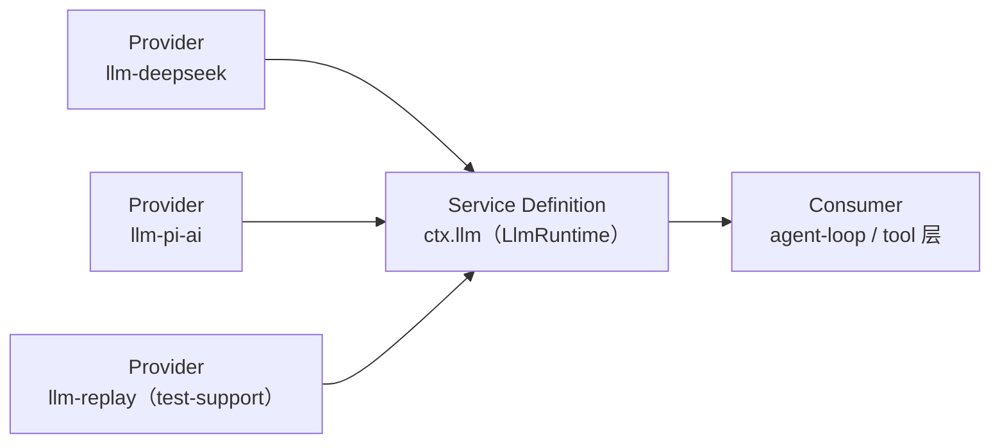

# 第 10 章 能力接缝：Service Definition / Provider / Consumer

> **本章目标**
> 1. 掌握 dsh 最核心的架构概念：能力接缝（capability seam）；
> 2. 理解三个角色：Service Definition / Service Provider / Consumer；
> 3. 看懂 `docs/capability-seams.md` 的完整服务图；
> 4. 理解"换一个 provider 换整个产品"为什么能成立。

## 10.1 生活化开场：电源插座

想象一座写字楼每个工位都有**统一的电源插座（标准）**，而不是每家电器
各带一种特殊接口。于是：

- **插座**定义了标准（Service Definition）；
- 各种**电源**（市电、UPS、发电机…）都可以插进来（Service Provider）；
- 任何**电器**（电脑、台灯…）只认插座，不知道电从哪来（Consumer）。

dsh 的能力接缝就是这个道理。`docs/glossary.md` 的定义：

> **Capability seam**: a swappable capability with three roles — a **Service
> Definition** declaring the interface, a **Service Provider** implementing it,
> and a **Consumer** using it, commonly a model-facing tool. A package may
> combine roles, but one role alone is not a seam.

**一个能力 = 三个角色，缺一不可**。这是 dsh 的 AGENTS.md 里反复强调的规则
（"A capability seam comprises Service Definition / Service Provider / Consumer
roles. It is complete, never one role."）。

## 10.2 三个角色，各自负责什么

| 角色 | 通俗说法 | 在 dsh 里的形态 | 例子 |
|------|---------|---------------|------|
| **Service Definition** | 定义"插座标准" | 一个服务接口 + 事件声明 | `ctx.llm`、`ctx.shell`、`ctx.subprocess` |
| **Service Provider** | 一个"电源"实现 | 实现该服务的包 | `llm-deepseek`、`bash-local`、`subprocess-local` |
| **Consumer** | 一个"电器" | 使用该服务的代码，通常是模型可见工具 | `tool-bash`、`tool-fs`、agent-loop |

用 LLM 能力举例（第 8 章）：

**Consumer 只认识 `ctx.llm` 这个键**，它不 import 任何 provider。
所以换 provider = 换一个实现该服务的包（配置层决定），Consumer 零改动。

## 10.3 为什么是"三个角色"而不是"一个接口"

如果只是"定义一个接口、多个实现"，dsh 已经做到了。**为什么强调三个角色？**
因为三个角色往往**演化速度不同**，分开才能各自演进：

- **Definition** 稳定（接口很少变）；
- **Provider** 频繁（新模型、新后端不断出现）；
- **Consumer** 面向模型（工具 schema、渲染方式随产品需求变）。

把它们拆开，就可以"只换 Provider"而不动 Definition/Consumer，反之亦然。
AGENTS.md 说：*split only when roles evolve independently*（只在角色独立演化
时才拆）。能力接缝的分拆不是教条，而是**跟着演化节奏走**。

## 10.4 一张图看懂 dsh 的接缝生态

`docs/capability-seams.md` 顶部是一张**生成的服务图**（mermaid），列出每个
服务、它的实现包、它的消费包。摘几个你会在本书其它章节见到的：

| 服务（Definition） | 实现（Provider） | 消费（Consumer） |
|--------------------|------------------|------------------|
| `ctx.llm` | llm-deepseek / llm-pi-ai（回放用的 llm-replay 在 test-support） | agent-loop、compaction-basic |
| `ctx.shell` | bash-local / bash-sandbox / pwsh-local | tool-bash、tool-pwsh |
| `ctx.subprocess` | subprocess-local / subprocess-ssh | bash-local、terminal-bash、lsp-stdio、subagent-* |
| `ctx.fs` | fs-local / fs-sandbox / fs-ssh | tool-fs |
| `ctx.sandbox` | sandbox-local / sandbox-ssh | fs-sandbox、bash-sandbox、terminal-bash |
| `ctx.subagents` | subagent-spawn-in-process / subagent-fork-in-process / subagent-acp / subagent-codex / subagent-claude-code / subagent-dsh-sdk | tool-subagent、tool-ralph |
| `ctx.workflowEngine` | workflow-ptc | tool-workflow、tool-ralph |
| `ctx.compaction` | compaction-basic | compaction-basic（自消费） |
| `ctx.sessionPersistence` | session-persistence-jsonl | session-query、hooks-*、message-feedback |

**注意这张图的生成方式**：它是 `scripts/gen-doc-graphs.ts` 从各包的服务声明
**自动生成**的（文件头有 "do not edit by hand"）。也就是说，**dsh 的架构图
不是手工维护的文档，而是从代码抽取的事实**——这保证了图永不过时。

## 10.5 接缝的威力："换 provider 换整个产品"

`docs/architecture.md` 的原话：

> Seams are why one provider swap changes the whole product. Filesystem and
> subprocess providers share one execution world, so pointing them at a remote
> sandbox moves Bash, PTY, and LSP with them, with no provider forks.

翻译：接缝让"换一个 provider"改变整个产品。比如文件系统（fs）与子进程
（subprocess）共享同一个"执行世界"——只要把它们都指向远程沙箱，
Bash、PTY、LSP 就跟着一起换到远程，**不需要为每个能力单独做远程分支**。

**这就是"接缝"比"一堆插件"更强的地方**：多个接缝可以**组合**成一个
更大的可替换单元。E2B 沙箱（第 11 章）就是靠这个能力——把 fs + subprocess
同时切到 E2B 后端，整个执行世界就搬进云端。

## 10.6 你该怎么用能力接缝

1. **加一个全新能力**：设计三件套——定义服务（Definition）、写至少一个
   实现（Provider）、让模型/循环消费它（Consumer）。只写 Provider 而没
   Consumer，不算完成一个接缝。
2. **加一个实现**：实现现有服务的接口，注册成 Provider，配置层切换。
3. **加一个消费方**：用服务方法或事件消费现有能力，不 import Provider。

**判断口诀**：如果你想"换个实现整个产品跟着变" → 设计成接缝；如果只是
"加个函数" → 不需要接缝，注册个工具就行。

## 10.7 本章小结

- 能力接缝 = Service Definition / Service Provider / Consumer 三件套；
- 三个角色演化速度不同，分开才能各自演进；
- `docs/capability-seams.md` 的服务图由代码自动生成，永不过时；
- 接缝能组合成更大的可替换单元（fs+subprocess → 整个执行世界）；
- 加新能力要设计三件套，只写一角不算接缝。

## 动手练习

1. 打开 `docs/capability-seams.md`，选一个你感兴趣的接缝（如 `ctx.shell`），
   用图找出它的 Provider 和 Consumer 各是哪些包。
2. 选一个包（如 `packages/fs/fs-local`），确认它实现了哪个服务的接口，
   以及它有没有"只实现、不消费"的问题。
3. 思考题：为什么"一个角色不算接缝"？举例：如果只定义了 `ctx.xxx` 接口
   但没有任何实现与消费方，它算不算一个能力？（答案见附录 C。）

---

**下一章**：[第 11 章 执行世界：shell / subprocess / terminal / sandbox](./ch11-execution-world.md)
