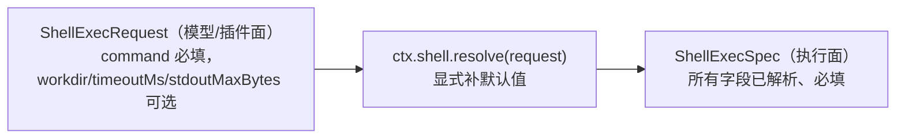

# 第 11 章 执行世界：shell / subprocess / terminal / sandbox

> **本章目标**
> 1. 理解"执行世界"：fs + subprocess + shell + terminal + sandbox 共享同一套命名空间；
> 2. 精读 shell 接缝的 request/spec 分离（`resolve()`），理解"显式 > 隐式"；
> 3. 理解 `DSH_*` 环境命名空间与凭据清洗；
> 4. 理解沙箱如何约束整个执行世界。

## 11.1 什么是"执行世界"

上一章提到一个关键洞察：**文件系统（fs）与子进程（subprocess）共享同一个
"执行世界"**。展开来说，dsh 里这些接缝共同描述"Agent 能碰到的外部现实"：

| 接缝 | 服务 | 描述 |
|------|------|------|
| `ctx.fs` | 文件系统 | 读/写文件、目录操作 |
| `ctx.subprocess` | 子进程 | 启动进程、收集输出 |
| `ctx.shell` | bash 执行 | 在 shell 里跑命令 |
| `ctx.terminals` | 持久 PTY | 长期会话式终端 |
| `ctx.sandbox` | 进程沙箱 | 限制以上所有能力的作用范围 |

`docs/subsystems/subprocess.md` 的原话（注意"同一个命名空间"）：

> One provider's spawn working directories, executable paths, ordinary
> processes, and terminal sessions inhabit the same path and process namespace
> as the mounted filesystem provider.

**这意味着"换执行世界"是一个整体操作**：把 fs + subprocess + shell + terminal
都指向远程/E2B 后端，整个执行世界就从本机搬进云端，不需要逐个能力改造。
这是第 10 章"接缝能组合成更大可替换单元"的实例。

## 11.2 shell 接缝：Definition / Provider / Consumer

`docs/subsystems/shell.md` 开头就把三件套写清楚了：

> The bash execution seam is split across a Service Definition
> ([dsh-shell](packages/shell/shell), `ctx.shell`), Service Providers
> ([dsh-bash-local](packages/shell/bash-local) and
> [dsh-bash-sandbox](packages/shell/bash-sandbox)), and Consumer
> ([dsh-tool-bash](packages/shell/tool-bash), the `bash` schema).

| 角色 | 包 | 说明 |
|------|-----|------|
| Definition | `packages/shell/shell` | `ctx.shell` 服务接口 |
| Provider | `bash-local` / `bash-sandbox` | 本地执行 / 沙箱内执行 |
| Consumer | `tool-bash` | 模型可见的 `bash` 工具 |

**`bash-sandbox` 是一个"组合型" Provider**：它复用 `bash-local` 的执行逻辑，
但把进程包进沙箱（第 15 章）。Provider 之间可以互相组合，这也是接缝设计的
魅力。

## 11.3 精读：request/spec 分离（`resolve()`）

`docs/subsystems/shell.md` 有一节标题就叫 "Request vs. spec: the `resolve()` split"，
它对应 dsh 的一条硬规则（AGENTS.md）：

> **Explicit > implicit at package boundaries**: defaulting is an explicit
> `resolve(request): Spec` step in the owning implementation, never a hidden
> `?? default` inside `run()`.

shell 接缝是这条规则的**模板**（AGENTS.md 原话 "the dsh-shell request/spec
split is the template"）。它的含义：



- **Request 是"请愿"**：调用方说"我要跑这条命令"，其它参数可省；
- **`resolve()` 是"定案"**：工具层显式调用 `ctx.shell.resolve(request)`，
  从配置/策略补全 `workdir`、`timeoutMs`、`stdoutMaxBytes` 等默认值；
- **Spec 是"执行令"**：所有字段已解析且必填，executor 直接照做。

**为什么反对"在 run() 里 `?? default`"？** 因为默认值藏在执行函数深处，
调用方看不到、测试测不到、策略也无法覆盖。显式 `resolve()` 让"默认值从哪来"
成为**可审查、可拦截**的一步——你可以注册一个 `resolve` 的拦截点改默认值。

## 11.4 subprocess 接缝：DSH_* 命名空间与凭据清洗

`docs/subsystems/subprocess.md` 展示了 dsh 对"子进程环境"的严谨管理：

### `DSH_*` 托管环境命名空间

`DSH_*` 变量是 Harness 拥有的"子进程事实"（child-process facts）：

```ts
/** 托管命名空间里的一把 key */
type DshEnvironmentKey = `${typeof DSH_ENV_PREFIX}${string}`
```

规则：实现**先丢弃环境里的 `DSH_*` 杂项**，再合并调用方显式 `env`——
于是"一个当前事实"只可能来自**显式字符串条目**，而显式 `undefined` 墓碑
（tombstone）删除普通的既有环境值。**这杜绝了"环境悄悄带进不该带的东西"。**

### 凭据清洗（credential scrub）

`scrubbedParentEnv` 保证子进程**不继承父进程的凭据**（API key 等）。
这是安全设计：Agent 跑的命令不该默认看到宿主机的密钥。

### `CollectedOutput`：收集输出的边界

每个收集的流通过 `CollectedOutput` 报告**截断与 spill 恢复状态**——
呼应第 9 章"输出溢出用 spill 文件"。

## 11.5 terminal：持久 PTY 会话

`docs/subsystems/terminal.md` 描述 `ctx.terminals`：**持久化的交互式终端会话**
（不是一次性跑命令，而是"开个终端、长期在里面操作"）。关键类型：

```ts
/** 一次 send 为什么返回控制权 */
type TerminalWaitReason = 'stdin_read' | 'inferred_idle' | 'timeout' | 'session_exit'

/** 顶层 PTY 进程状态 */
type TerminalSessionStatus =
  | { kind: 'running' }
  | { kind: 'exited'; exitCode: number | null; signal: NodeJS.Signals | null }
```

**注意 `TerminalWaitReason` 与 `TerminalSessionStatus` 的分离**：
"这次发送为什么返回"（可能只是超时/静默，shell 还活着）与"顶层 shell
是否退出"是两回事。文档特别强调 `session_exit` 才意味着顶层 shell 真的
退出了，而不是某个前台子进程退出。**这种精细的状态分离**是长期运行
Agent 可靠性的基础（避免误判会话已死）。

## 11.6 sandbox：约束执行世界

`ctx.sandbox` 是"进程沙箱"接缝（`docs/subsystems/sandbox.md`）。它的角色：
**在执行世界的入口加一道约束**。消费方（fs-sandbox、bash-sandbox）在真正
spawn 之前把命令包进沙箱。

- 本地沙箱 `sandbox-local` 基于 macOS 的 landlock（`native/@deepseek-ai/
  node-addon-landlock-run`）；
- `sandbox-policy` 是"沙箱策略的唯一归属方"（`ctx.sandboxPolicy`），
  负责解析当前会话用哪种沙箱模式（off / read-only / workspace-write / full）；
- **沙箱模式会被写进运行时上下文快照并记入会话日志**——因为"模型请求时
  处于什么权限下"也是模型可见事实的一部分（第 5 章的可重建性延伸到安全层）。

第 15 章会专门讲安全。

## 11.7 本章小结

- "执行世界" = fs + subprocess + shell + terminal + sandbox 共享同一命名空间；
- shell 接缝三件套：Definition / Providers / Consumer；
- `resolve()` 分离 request/spec：显式默认值是"可审查、可拦截"的；
- subprocess 管理 `DSH_*` 环境 + 凭据清洗 + CollectedOutput 边界；
- terminal 区分"等待原因"与"会话状态"，避免误判；
- sandbox 在入口约束整个执行世界，且模式进日志。

## 动手练习

1. 读 `packages/shell/shell/src/types.ts` 的 `ShellExecRequest` 与
   `ShellExecSpec`，找出哪些字段是 request 可选、spec 必填。
2. 在 `packages/shell/bash-local` 里找到 `resolve()` 的实现，看它从哪个
   配置补默认值。
3. 思考题：为什么"默认值藏在 run() 里"不好？结合"测试能不能覆盖默认值"
   "策略能不能改默认值"两个角度回答。（答案见附录 C。）

---

**下一章**：[第 12 章 更多接缝：web / subagent / skill / MCP](./ch12-more-seams.md)
