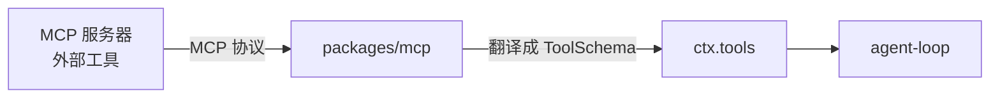

# 第 12 章 更多接缝：web / subagent / skill / MCP

> **本章目标**
> 1. 通过 web 接缝理解"一个服务、多个操作、Provider 注册能力而非工具"；
> 2. 通过 subagent 接缝理解"多 Provider 共存、按名注册"的注册表模式；
> 3. 理解 skill 接缝的分层注册表（host + per-scope）；
> 4. 理解 MCP 如何把外部工具映射进 `ctx.tools`。

## 12.1 web 接缝：一个服务、两个操作

`docs/subsystems/web.md` 展示了一个有趣的接缝设计：**`ctx.web` 横跨两个操作
（search 与 fetch），但它们共享一个中间层**。

> Web is **one optional capability**, not part of the agent-loop spine — so its
> vocabulary lives here, not in core.md.

三件套：

| 角色 | 包 |
|------|-----|
| Definition | `packages/web/web`（`ctx.web` + provider 注册表） |
| Provider | `web-search-exa` / `web-search-perplexity` / `web-search-deepseek` / `web-fetch-http` |
| Consumer | `tool-web`（`web_search` / `web_fetch` 工具 schema） |

**两个关键设计**：

1. **search 与 fetch 故意放在一个 `ctx.web` 里**：它们请求 schema 不同、业务
   逻辑不同，但共享"一个 provider 选择策略、一套 abort/error 词汇、一个面向
   产品的配置 API"。文档明确说："The cost is the parallel searchX/fetchX method
   pairs... that parallelism is intentional, not a missed extraction."——这是
   **刻意的平行**，不是漏掉的抽取。

2. **Provider 注册"能力（capability）"而非"工具"**：`WebSearchProvider` /
   `WebFetchProvider` 是能力；而模型面向的**名字、schema、提示词、呈现**
   全部在 `dsh-tool-web` 这一个 Consumer 里。
   > A search-provider swap does not change how the model asks for a query, and
   > a fetch-provider swap does not change how the model asks for a URL.

   **这就是接缝的价值**：换搜索服务商，模型根本无感。

**另一个细节**：模型面向的参数只是一个 `query`，`maxResults` 是 Consumer
（tool-web）的配置（默认 8），在返回路径上**由接缝强制截断**——provider
超量返回时，接缝截断 `sources[]` 并置 `truncated` 标记。**边界上的强约束**
（而不是信任 provider）是 dsh 的一贯风格。

## 12.2 subagent 接缝：多 Provider 共存的注册表

`docs/subsystems/subagent.md` 用一句话点出它和 bash 的关键差异：

> It differs from the other capability seams because **multiple provider
> implementations coexist** in one context, registered by name (`ctx.subagents`),
> while bash allows only one executor.

**bash 是"单执行器"**（一次只有一个后端）；**subagent 是"多 Provider 共存"**——
按名字注册（`subagent-spawn-in-process`、`-fork`、`-acp`、`-codex`、
`-claude-code`、`-dsh-sdk`），由服务按名路由。它的注册表模型跟 LLM 适配器
注册表一致，而不是 bash 的单服务模型。

三件套：

| 角色 | 包 |
|------|-----|
| Definition | `packages/subagent/subagent`（`ctx.subagents` + 词汇） |
| Provider | `subagent-spawn-in-process` / `-fork` / `-acp` / `-codex` / `-claude-code` / `-dsh-sdk` |
| Consumer | `tool-subagent`（按 provider 委派）、`tool-subagent-control`（send_message / interrupt_agent / list_agents）、`tool-subagent-report`（子代理回报通道） |

### Provider 契约：start() 与 continuable

- **一次性（one-shot）路径**：`SubagentProvider.start()`，provider 自己组合
  子代理；它的**静态能力描述**（start-time features）在跑之前检查——请求
  需要而 provider 没有的能力，**大声拒绝**（`SubagentError('UNSUPPORTED_CAPABILITY')`），
  绝不"接了再忽略"。这就是 AGENTS.md 的"fail loud, no silent degradation"。
- **可延续（continuable）路径**：由 continuation manager 自己组合，用
  **一个可选方法（`prepareContinuable`）的存在**作为能力标识，TS 收窄
  就是发现机制。**"方法存在即能力"**——用类型系统表达能力有无，非常优雅。

### 工具层的三分

- `tool-subagent`：**按 provider 委派**（告诉模型"有哪几个子代理后端可选"）；
- `tool-subagent-control`：可选的全局控制（给子代理发消息、打断、列列表）；
- `tool-subagent-report`：可选的子代理作用域内"回报"通道。

**为什么 subagent 值得单独一章**：它展示了"多 Provider + 名字路由 + 能力
描述 + 类型收窄发现"这套更丰富的接缝形态——当你的能力"有多种实现可并存"
时，这就是模板。

## 12.3 skill 接缝：分层注册表

`docs/subsystems/skills.md` 描述技能家族：

| 角色 | 包 |
|------|-----|
| Definition | `packages/skill/skill`（`ctx.skills`） |
| Provider | `skill-filesystem`（本地）、`skill-badge`（打包徽章） |
| Consumer | `tool-skill`（模型面向的 `skill` 工具） |

**技能是可选的指令，不是会话事件**（Skills are optional instructions, not
session events）——所以它的词汇在 skill 包里，不在 core.md。

关键机制是**分层注册表**（host + per-scope layered）：

- 注册表沿"调用方所在 context 的 scope 分层"归档：宿主行与仓库插件进全局层，
  某个 agent preset 挂载的插件进该 preset 层；
- **读取时合并全局层 + 观察者 scope 链**：最近层的条目优先（同名技能就近
  获胜），层内才用 rank/provider/local 顺序决胜负；
- **provider 名按层唯一，而非进程级唯一**——同名的技能可以在不同层各有
  定义，各归各的 agent。

这呼应第 13 章的 scope 设计：**"技能对谁可见"由 scope 决定**，不同会话
可以有不同的技能集。

## 12.4 MCP：把外部工具映射进 `ctx.tools`

dsh 的 `packages/mcp/` 提供 MCP 客户端（`connection.ts` 连接管理、
`transport.ts` 传输、`tools.ts` 工具映射）。核心思想：

> **把 MCP 服务器暴露的工具翻译成 dsh 的 `ToolSchema`，注册进 `ctx.tools`。**

**Agent 循环完全无感**：外部 MCP 工具与本地工具在循环看来没有区别。
这让我们第 9 章的"工具注册表 + 执行流水线"可以统一处理"本地工具"与
"外部工具"——审批、沙箱、日志都自动覆盖 MCP 工具。

## 12.5 本章小结

- web 接缝：一个服务两个操作，Provider 注册能力，Consumer 拥有模型面向层；
- subagent 接缝：多 Provider 按名共存，start() + continuable 两条路径，
  能力用类型收窄表达，不支持即大声拒绝；
- skill 接缝：host + per-scope 分层注册表，就近获胜，技能可见性由 scope 决定；
- MCP：把外部工具翻译成 ToolSchema 注册进 ctx.tools，循环无感。

## 动手练习

1. 读 `packages/subagent/subagent/src/types.ts` 的 `SubagentProvider` 接口，
   找出 `start()` 与 `prepareContinuable`，理解"方法存在即能力"。
2. 读 `packages/web/tool-web`，确认 `maxResults` 是 Consumer 配置并在返回路径
   上强制截断。
3. 思考题：为什么 subagent 用"按名注册的多 Provider"，而 bash 用"单执行器"？
   （提示：从"能力之间是否互相独立"想，答案见附录 C。）

---

**下一章**：[第 13 章 系统提示词组装与 scope](./ch13-system-prompt.md)
