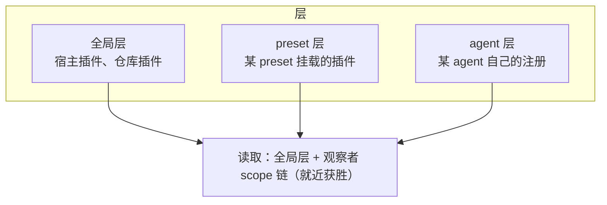

# 第 13 章 系统提示词组装与 scope

> **本章目标**
> 1. 理解系统提示词不是一段文本，而是一套"分片注册 + 排序 + 瀑布"的组装系统；
> 2. 掌握 `PromptSection`、`order` 约定与 `system-prompt/assemble` 瀑布；
> 3. 理解 scope：把注册限定到某个 agent，实现"每个会话有不同的系统提示与工具集"；
> 4. 看懂分层注册表（scoped layers store）。

## 13.1 系统提示词：一段"拼出来的"文本

`packages/core/system-prompt/src/index.ts` 模块头：

> Registry for ordered system sections, dynamic context, tool schemas, and
> prompt variables.

**dsh 把"系统提示词"当成一个可插拔的组装系统**，而不是一段写死的字符串。
谁都能往里加"分片（section）"，组装时按顺序拼起来。

```ts
export interface PromptSection {
  readonly name: string                          // 唯一名
  readonly order: number                         // 排序权重
  readonly text: string | ((context) => string)  // 静态文本或动态函数
}
```

**order 约定**（代码注释）：`-100` 放框架身份、`0` 放部署人设、`100-199`
放工具使用指南。**排序本身就是一种"策略"**：身份在最前，工具指南在后，
符合模型"先立规矩再给工具"的阅读习惯。

**text 可以是函数**：每次组装时求值，注入"当前时间、当前仓库、用户偏好"
等动态内容（agent-book 第 10 章讲过"动态上下文"）。

## 13.2 组装瀑布：`system-prompt/assemble`

组装不是"把字符串拼起来"那么简单，它走一个 **waterfall**
（`system-prompt/assemble`），让插件能在最终提示上做最后的改写：

> Expert waterfall over the assembled sections, contexts, tools, and
> variables. Scope-filtered dispatch... The returned value is authoritative.

注意两个细节：

1. **scope 过滤**：只给"该 scope 的组装"派发（下一节讲 scope）；
2. **权威返回**：瀑布的返回值就是最终系统提示，任何插件都可以替换。

`renderPrompt(assembly)` 最后把分片拼成一段文本（第 7 章 `step()` 里
`const system = renderPrompt(assembly)`）；`renderContextSections` 拼运行时
上下文（动态部分，每回合重算）。

## 13.3 scope：把注册限定到某个 agent

**scope 是 dsh 让"一个进程里跑多个不同 Agent"的核心机制**。
`docs/subsystems/scope.md` 与多篇 Agent Note
（`2026-07-08-agent-scope-contexts`、`2026-07-12-agent-scope-runtime-design`、
`2026-07-12-scoped-layers-store`）讲透了它。

### 问题

一个 dsh 进程可能同时跑多个 Agent 会话（多个用户、多个任务、主代理 + 子代理）。
如果它们共享一个全局的工具集、系统提示、事件监听器，就会互相污染：
A 会话注册的工具出现在 B 会话，B 会话的注入上下文污染 A。

### 解法：每个 Agent 一个作用域

- 每个 `Agent` 有一个 `agent.ctx`（作用域化 context）；
- 用 `agent.ctx` 注册的工具、系统提示分片、事件监听器，**只对这个 agent 生效**；
- 外部代码通过 `agent.ctx` "进入"某个 agent 的作用域。

看 `docs/architecture.md` 的"Where new behavior goes"表最后一行：

> Scope a registration to one agent | use that agent's `agent.ctx`

### 分层注册表（scoped layers store）

`2026-07-12-scoped-layers-store` 描述了实现：**注册按"层（layer）"归档**，
读取时按"全局层 + 观察者作用域链"合并。



**就近获胜**：同名条目，最近层优先。所以主代理和子代理可以同名不同实现，
各用各的。第 12 章 skill 的分层注册表、第 9 章工具注册表都建立在这套
scoped layers 之上。

## 13.4 组合起来：每个会话的系统提示

把"系统提示组装"与"scope"合起来，就得到 dsh 的强大能力：
**不同会话看到不同的系统提示与工具集**：

- 全局分片（框架身份、通用工具指南）进全局层；
- 某 preset 的分片（该 preset 的人设、专用工具）进 preset 层；
- 某 agent 运行时注入的分片进该 agent 层。

组装时按 scope 链合并，`system-prompt/assemble` 瀑布按 scope 过滤派发。
于是"A 助手（带代码评审技能）"和"B 助手（带客服技能）"可以在同一个进程
里和谐共存。

## 13.5 工具 schema 也进组装

别忘了：系统提示组装不只拼文本，还收集**工具 schema**。`assembleContextFor`
返回的 `assembly` 同时带 `tools`（第 7 章 `buildRequest` 用了
`assembly.tools`）。**"有哪些工具可见"也是 scope 的结果**——A 会话看不到
B 会话注册的工具。

## 13.6 本章小结

- 系统提示 = 分片注册 + 排序 + 瀑布组装，text 可动态求值；
- `system-prompt/assemble` 是 scope 过滤的权威瀑布；
- scope = 每 agent 一个 `agent.ctx`，把注册限定到单个 agent；
- 分层注册表：全局层 + scope 链，就近获胜；
- 系统提示与工具集都是"scope 的函数"，多 Agent 可和谐共存。

## 动手练习

1. 在 dsh 仓库 `grep -rn "systemPrompt.section" packages/`，找一个注册分片的
   插件，读出它的 `name`、`order`、`text`（静态还是动态）。
2. 读 `packages/core/scope/`，找出 `scopeOf` / `scopeTarget` 之类的 API，
   理解"进入作用域"怎么写。
3. 思考题：为什么"系统提示组装瀑布"要按 scope 过滤派发？
   （提示：如果不过滤，会发生什么？答案见附录 C。）

---

**下一章**：[第 14 章 持久化、存储与压缩](./ch14-persistence.md)
第三部分到此结束。你已经见过 dsh 最核心的机制与接缝。接下来进入"把它做成产品"
的工程话题。
