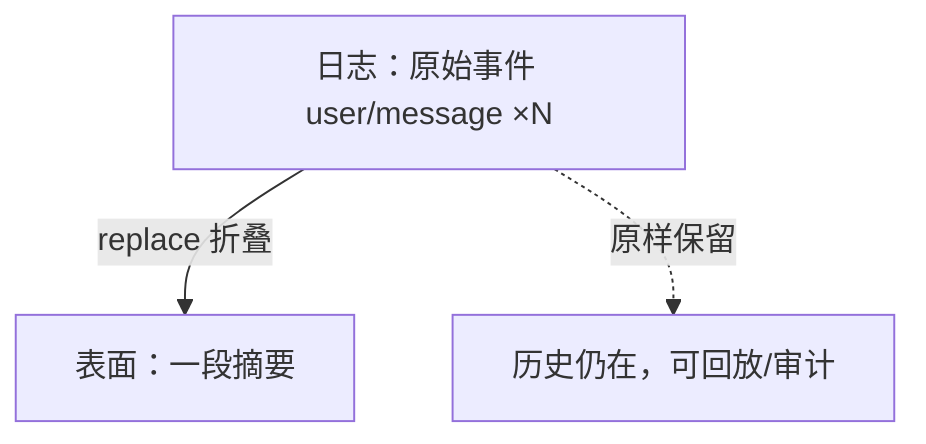

# 第 14 章 持久化、存储与压缩

> **本章目标**
> 1. 理解会话持久化接缝：jsonl / sqlite 两个后端，`session/flush` 检查点；
> 2. 理解 `ctx.storage`（非会话存储枢纽）与 spill（输出溢出）；
> 3. 理解压缩接缝与 `compaction-basic`：如何用"摘要替换表面"而不改日志；
> 4. 把"模型可见 ⟺ 可记录"贯穿到磁盘层面。

## 14.1 持久化：从内存日志到磁盘

第 4 章说过：`core/session` 只提供**内存日志**，落盘是插件的事。
持久化接缝（`docs/subsystems/persistence.md`）：

| 角色 | 包 |
|------|-----|
| Definition | `session-persistence`（`ctx.sessionPersistence`） |
| Provider | `session-persistence-jsonl`（每个会话一个压缩 JSONL 日志） |

接缝只导出一套**与服务定义无关的句柄契约**（`create` / `open` / `stat` /
`list` / `export`、`SessionHandle`、稳定的错误类）；别的后端只要实现同一套契约
即可，共享的 `runPersistenceContract` / `runLiveWritePathContract` 测试套件
钉住所有后端必须一致的可观测行为。

**写盘策略**（Agent Note `2026-06-11-event-sourced-sessions`）：

> Appends are synchronous (the hot path never blocks on I/O); `session/event`
> is a sync notification; persistence plugins buffer write-behind and drain at
> the awaited `session/flush` checkpoint fired at every turn end.

- **追加是同步的、不阻塞 I/O**：`session.append` 只写内存；
- **持久化插件异步写盘**：订阅 `session/event` 缓冲，在**每个回合结束**的
  `session/flush` 检查点排空；
- 所以"模型请求进行中"不会因磁盘慢而卡住，但回合结束保证落盘。

**版本管理**：会话日志用 `SESSION_FORMAT_VERSION`（当前 `4`）。句柄只暴露
当前逻辑记录；后端必须在返回句柄前把**支持的历史世代**转换成当前格式
（JSONL 后端就带着这样一份静态的世代目录），遇到**比自己新**的格式则拒绝
并提示升级 harness，遇到不认识的、又没有 `ignorable` 标记的事件类型也拒绝
（第 4 章的版本机制）。顺带一提，**物理介质**各有自己的版本号、策略也不同：
`storage-sqlite` 把物理布局版本存在 `PRAGMA user_version` 里，版本不符就
直接拒绝、不迁移；`session-query-sqlite` 是**可丢弃的派生索引**，schema
版本不符时就地重建。

## 14.2 `ctx.storage`：非会话存储枢纽

除了会话日志，dsh 还有一个**通用存储枢纽** `ctx.storage`
（`docs/subsystems/storage.md`）：

| 服务 | 作用 |
|------|------|
| `ctx.storage` | 非会话的通用存储（键值/文件） |
| `ctx.storageDomain` | 领域数据设施 |
| `ctx.spillStore` | 溢出存储接缝（超大工具输出） |

**spill（溢出）**：工具输出过大时，把完整内容写到 spill 存储，只把摘要放进
会话（第 9 章提过 `2026-07-08-tool-output-spill-files`）。这是"会话日志保持
可重建 + 不撑爆上下文"的折中——**完整数据在别处可寻址，会话里只留摘要**。

## 14.3 压缩：改"表面"不改"日志"

压缩（compaction）是"上下文放不下"的解法。dsh 把它做成一个**能力接缝**
（`ctx.compaction`）：

| 角色 | 包 |
|------|-----|
| Definition | `packages/compaction/compaction`（`ctx.compaction`） |
| Provider | `compaction-basic`（基础摘要实现） |
| 配套 | `compaction-tool-result-pruner`（工具结果裁剪）、`command-compact`（手动触发） |

### compaction-basic 的三个文件

`packages/compaction/compaction-basic/src/`：

- `summarizer.ts`：调用模型把历史总结成摘要；
- `region.ts`：标记"可压缩的区域"（哪些消息可以被摘要替换）；
- `config.ts`：压缩触发阈值、模型选择等可配置项。

### 关键：压缩如何与"日志即真相"共存

回忆第 4 章的 `SurfaceOp`：`{ op: 'replace'; start; end }`。
**压缩正是用 replace 改写"表面视图"**——把一段旧消息换成摘要，
而**日志里原始事件原封不动**。

这就是"模型可见 ⟺ 可记录"能扛住压缩的原因：**模型看到的是摘要（表面），
日志保留的是真相（原始事件）**。压缩改的是视图，不是状态。

### 何时压缩：after-call 压力与溢出恢复

`docs/subsystems/compaction.md`：压缩触发点是**调用后压力**——一次工具调用后
上下文触顶，才触发压缩并恢复（`CompactionTrigger = 'pressure' |
'context-overflow'`）。对比 codex 在采样循环里"发现触顶立刻压缩再继续"
（agent-book 第 8 章），dsh 把它放在**维护阶段（maintenance）**，让循环本体
保持干净（agent-book 第 9 章讲过的分歧）。（早期 Agent Note
`2026-07-10-after-call-compaction-pressure-and-overflow-recovery` 已于
2026-09-30 归档，只作历史。）

## 14.4 会话查询与标题：从日志派生的产品功能

两个"日志派生"的例子，体现"日志即真相"的辐射面：

- **`ctx.sessionQuery`**：会话读取、追踪、过滤、搜索（`session-query` +
  `session-query-sqlite`）。内容检索是**部署可选**的：provider 用
  `openAt: 'never'` 关掉索引，此时 `searchSessions`/`searchEvents` 返回
  `SESSION_QUERY_SEARCH_DISABLED`，而精确读取、过滤、追踪照常
  （`docs/subsystems/session-query.md`）；
- **`ctx.sessionTitle`**：日志驱动的会话标题生成（`session-title-first-prompt-llm`
  / `session-title-all-prompts-llm`）。AGENTS.md 说 "Generate session titles |
  register the sole ctx.sessionTitle provider"——标题也从日志派生，可审计。

## 14.5 本章小结

- 持久化是插件接缝：jsonl / sqlite，`session/flush` 检查点批量写盘；
- `ctx.storage` 与 spill：超大输出溢出到可寻址存储，会话只留摘要；
- 压缩 = replace 表面视图，日志真相原样保留；
- 压缩在维护阶段做，循环本体保持干净；
- 查询、标题等产品功能都从日志派生，可审计。

## 动手练习

1. 读 `packages/compaction/compaction-basic/src/region.ts`，理解"可压缩区域"
   怎么界定（哪些消息可以被摘要替换）。
2. 在 dsh 里找一个 `session/flush` 的监听者（持久化后端），确认它在
   回合结束时排空缓冲。
3. 思考题：为什么压缩"改表面视图"而不是"直接删日志"？删日志会破坏什么
   不变量？（答案见附录 C。）

---

**下一章**：[第 15 章 沙箱、审批与安全](./ch15-security.md)
