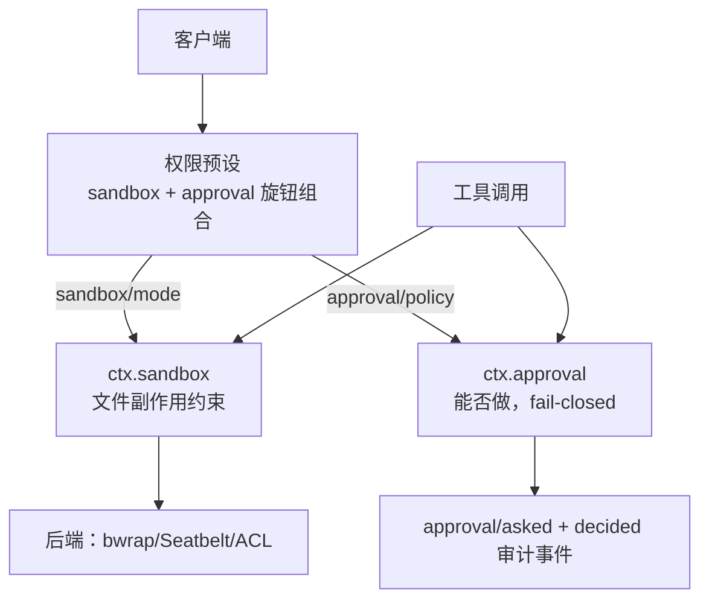

# 第 15 章 沙箱、审批与安全

> **本章目标**
> 1. 理解审批接缝（`ctx.approval`）：只回答"这个动作能不能做"；
> 2. 理解沙箱接缝（`ctx.sandbox`）：只约束文件副作用，网络/进程可见性在外；
> 3. 理解权限预设（`ctx.permissionPresets`）：把两个旋钮打包成命名预设；
> 4. 掌握 dsh 的安全哲学：fail-closed（默认拒绝）。

## 15.1 审批接缝：回答"能不能做"

`docs/subsystems/approval.md`：

> The user-approval seam ... answers one question: may this specific action
> proceed?

三件套：

| 角色 | 包 |
|------|-----|
| Definition | `packages/interaction/user-approval`（`ctx.approval`） |
| Answerer | UI 通道提供人类审批；ACP 桥提供机器一次性决策 |
| Consumer | `core/tools`、`tool-bash` 等消费**闭合结果**，fail-closed |

**关键机制**：

1. **`approval/request` 是 waterfall**：answerer 决定结果（允许/拒绝/仅一次）。
   注意它叫 "answerer waterfall"——人类/机器都可以作答；
2. **`ApprovalRequestId` 是 brand**（`Branded<'ApprovalRequestId'>`）：
   用于把 `approval/asked` 与 `approval/decided` 两个**审计事件**配对，
   同时保证审批 id 不会与工具调用 id、会话 id 混用（第 16 章讲 branded ids）；
3. **fail-closed**：消费方（工具）拿到闭合结果后，**除非是 `allowed-once`，
   否则默认不放行**。文档原文：
   > Callers ... consume the closed outcome and fail closed unless it is
   > `allowed-once`.

**"默认拒绝、显式放行"**是安全设计的基石——出任何意外，结果是"不让做"，
而不是"放行"。

## 15.2 沙箱接缝：只约束文件副作用

`docs/subsystems/sandbox.md`：

> The process-sandbox seam ... wraps a same-world subprocess argv in a
> file-effect policy without coupling consumers to a platform runner.

三件套与后端：

| 角色 | 包/后端 |
|------|---------|
| Definition | `packages/sandbox/sandbox`（`ctx.sandbox`） |
| Provider | `sandbox-local`：Linux bwrap/Landlock、macOS Seatbelt、Windows ACL 受限令牌 |
| Consumer | `bash-sandbox`、`pwsh-sandbox` |

**关键认识一：`SandboxMode` 只约束"文件副作用"**，网络与进程可见性在词汇之外：

```ts
type SandboxMode = 'read-only' | 'workspace-write' | 'danger-full-access'
```

- `read-only`：拒绝写（POSIX 运行器额外授予 shell 需要的 `/dev/null` 汇点）；
- `workspace-write`：允许写工作区根 + 后端承诺的临时区；
- `danger-full-access`：绕过约束。

**"网络和进程可见性在词汇之外"**是个诚实的设计：一个模式词汇不要试图
表达所有维度，管好文件副作用这一个维度，别的不打包承诺。

**关键认识二：容器/microVM/远程执行是"整个能力接缝的兄弟实现"，不是
`ctx.sandbox` 的 provider**。文档原文：

> Containers, microVMs, and remote execution are sibling implementations of
> whole capability seams, not providers of `ctx.sandbox`.

这呼应第 10、11 章：E2B 是**把 fs + subprocess + shell 整体切走**的"执行世界
替换"，而不是"在沙箱层加一个后端"。**分层的边界要分清**。

## 15.3 权限预设：把旋钮打包

`docs/subsystems/permission-presets.md`（`ctx.permissionPresets`）：

> bundles the two independent enforcement knobs — sandbox mode (`sandbox/mode`)
> and approval policy (`approval/policy`) — into named presets.

- **两个独立旋钮**：沙箱模式 + 审批策略；
- **预设 = 一个旋钮组合**：默认表提供 `workspace-write`（workspace-write +
  ask）和 `danger-full-access`（danger-full-access + never）；
- **预设不拥有执行权**：它只"记录意图并写入每个旋钮的 canonical setter"——
  执行、提示词叙述、回放仍然各自读自己的旋钮折叠。

**为什么预设"不拥有执行权"很重要**：预设是**客户端 UI 的一个选择器**，
不是安全边界的实现。真正的强制发生在沙箱/审批各自的后端。**别把"意图"
和"执行"混为一谈**——这是 dsh 安全分层的关键。

## 15.4 把安全接进"模型可见 ⟺ 可记录"

第 11 章提过：**沙箱模式会被写进运行时上下文快照并记入会话日志**。
看 `docs/subsystems/sandbox.md` / `sandbox-policy` 的注释（agent-book 第 13
章也讲过）：

> Before each agent request, the owner also contributes the resolved policy to
> the cache-safe runtime-context snapshot. The agent loop logs that snapshot
> as model history, so replay reconstructs the same mode and root the
> enforcing consumers resolve.

**为什么沙箱模式也要进日志？** 因为"模型请求时处于什么权限下"是模型可见
事实的一部分。回放时必须能重建"当时它在只读模式"，才能解释它为什么
"不写那个文件"。**安全状态也是可重建状态**——第 5 章不变量在安全层的延伸。

## 15.5 dsh 的安全分层总览

把本章的安全组件串起来：



**纵深防御**：预设是意图，审批是闸门（默认拒绝），沙箱是约束（文件副作用），
审计是记录。任何一层被绕过，其它层仍在。

## 15.6 本章小结

- 审批回答"能不能做"：waterfall + fail-closed + branded 审计 id；
- 沙箱约束"文件副作用"：read-only / workspace-write / danger-full-access；
- 容器/远程是"执行世界"整体替换，不是沙箱 provider；
- 权限预设把两个旋钮打包，但不拥有执行权；
- 安全状态也进日志，"安全层可重建"。

## 动手练习

1. 读 `docs/subsystems/approval.md`，找到 `approval/request` 是哪种分发模式，
   以及 `approval/asked` / `approval/decided` 这对审计事件。
2. 读 `docs/subsystems/sandbox.md` 的 SandboxMode 说明，对比 dsh 的
   `danger-full-access` 与你在 agent-book 里见过的 codex 沙箱权限。
3. 思考题：为什么容器/microVM"不是 ctx.sandbox 的 provider"？
   （提示：从"它替换的是什么"与"沙箱约束的是什么"两个层次想，答案见附录 C。）

---

**下一章**：[第 16 章 测试、不变量与质量门禁](./ch16-testing.md)
